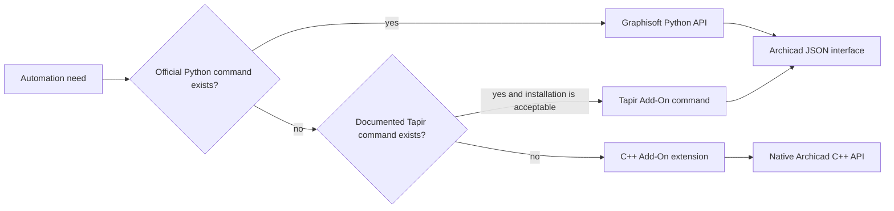

# Architecture and API selection

The repository has three intentionally separate execution layers:



`archicad_tools` adds connection errors, metadata properties, and explicit Tapir dispatch; it deliberately exposes `commands`, `types`, and `utilities` from Graphisoft instead of wrapping every generated method. This keeps the official source visible and avoids an incomplete parallel API.

The C++ Add-On has a stable feature/entry layer and a narrow compatibility boundary:

```text
AddOnMain.cpp → src/compat/ArchicadCompatibility.* → pinned DevKit API
```

Build orchestration flows from `archicad-dev.yaml` to the PowerShell bootstrap, CMake presets, and six CI jobs. DevKits and Tapir binaries terminate in ignored local directories; only their metadata and checksums are versioned.

## Upstream ownership

- `archicad-addon-cmake` is a reference template; it is not merged automatically.
- `archicad-addon-cmake-tools` is a Git submodule pinned to a commit.
- `archicad-api-devkit` releases are pinned downloads, not repository content.
- Tapir is an optional pinned runtime Add-On and reference implementation.

The weekly workflow proposes changes on a branch and opens or refreshes a pull request. It does not merge, release, or add a major version.
